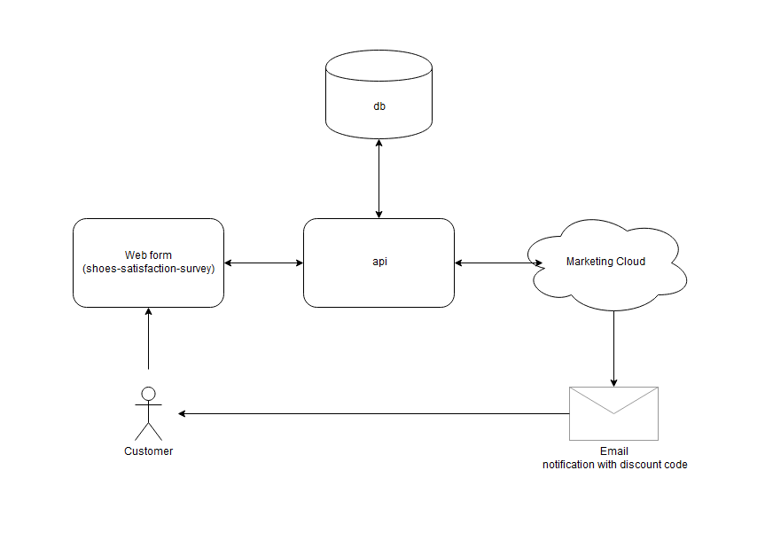

# SHOES SATISFACTION SURVEY

Use case requested while participating in a hiring proccess. The use case defines a e2e system consisting of a public website with a form where a customer will give feedback about last interactions with the seller, and as a reward for that information the customer will receive via email a discount code to use in future transactions.
The system built consists of the following components:
- Web form build using Angular
- API build using NestJs. This API integrates with the database and with a external marketing cloud
- Postgres database to store form data and discount codes
- Mocked components of the marketing Cloud to use. those components are an authentication server, and an API tu push information and to send emails to clients

The styling, typographies, assets, etc. were all extracted from the [Nike homepage](https://www.nike.com/)

**The application is not ready for production**, as it relies in development servers right know, and the project is not finished yet. Improvements and new functionality will be added constantly.

## Quick Start & Documentation

This project was build using [Nx](https://nx.dev/)

To start the project locally you need to have installed [Docker](https://www.docker.com/get-startedrun) on your machine. Once you have it installed, run the following commands in the specified order:

  - `npm run start:db`
  - `npm run start:back`
  - `npm run start:front`
  - `npm run start:auth`
  - `npm run start:marketing-cloud`

This will serve the web form in http://localhost:4200

## Generate a library

Run `ng g @nrwl/angular:lib my-lib` to generate a library.

> You can also use any of the plugins above to generate libraries as well.

Libraries are shareable across libraries and applications. They can be imported from `@myorg/mylib`.

## Build

Run `ng build my-app` to build the project. The build artifacts will be stored in the `dist/` directory. Use the `--prod` flag for a production build.

## Unit tests

Unit tests were written for the key components that needed to be comprehensively checked. The rest of the components of the project are covered by e2e test cases.

Run `npm run test:api` to execute the unit tests via [Jest](https://jestjs.io).

## End-to-end tests

End-to-end tests were written to cover the general use cases of the whole system. In order to execute them the following applications/components must be running:

  - db
  - api
  - marketing-cloud-authentication-mock
  - marketing-cloud-rest-mock

Run `npm run test-e2e` to execute the end-to-end tests via [Cypress](https://www.cypress.io).

## Further help

Visit the [Nx Documentation](https://nx.dev/angular) to learn more.
